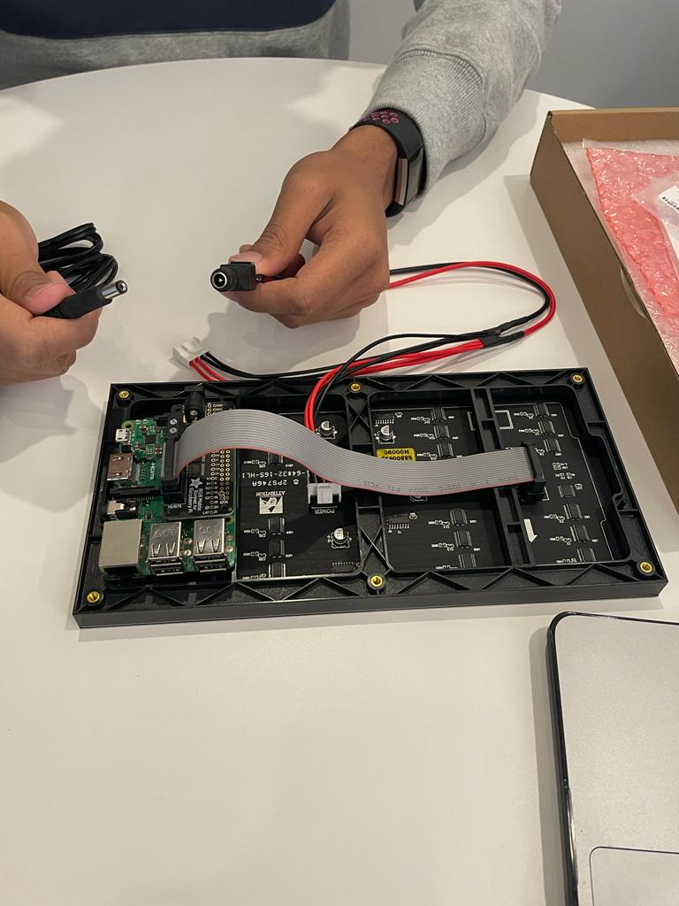
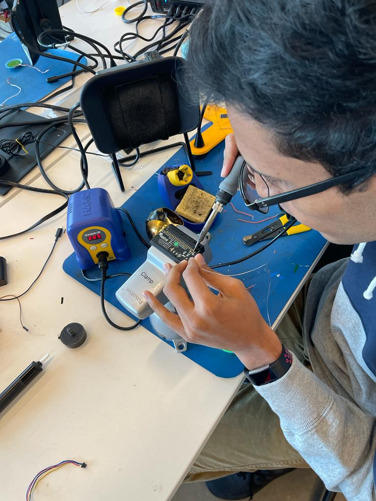
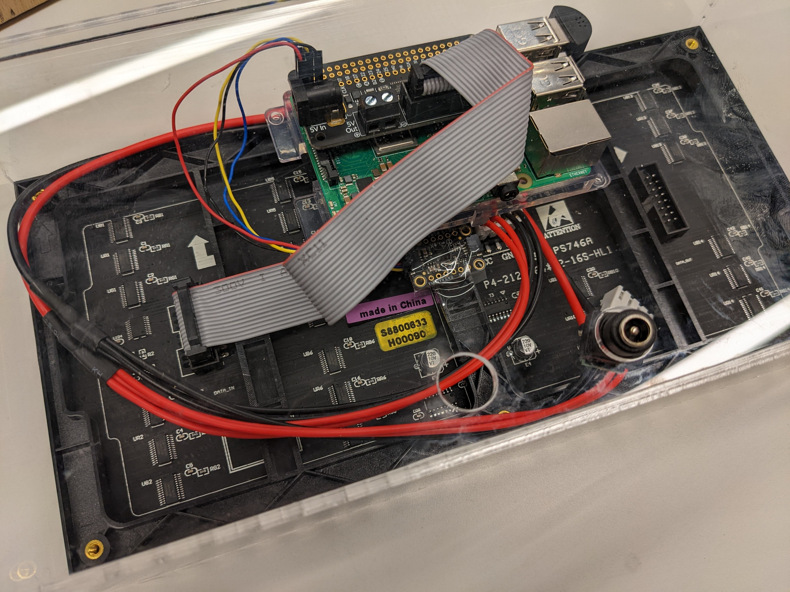
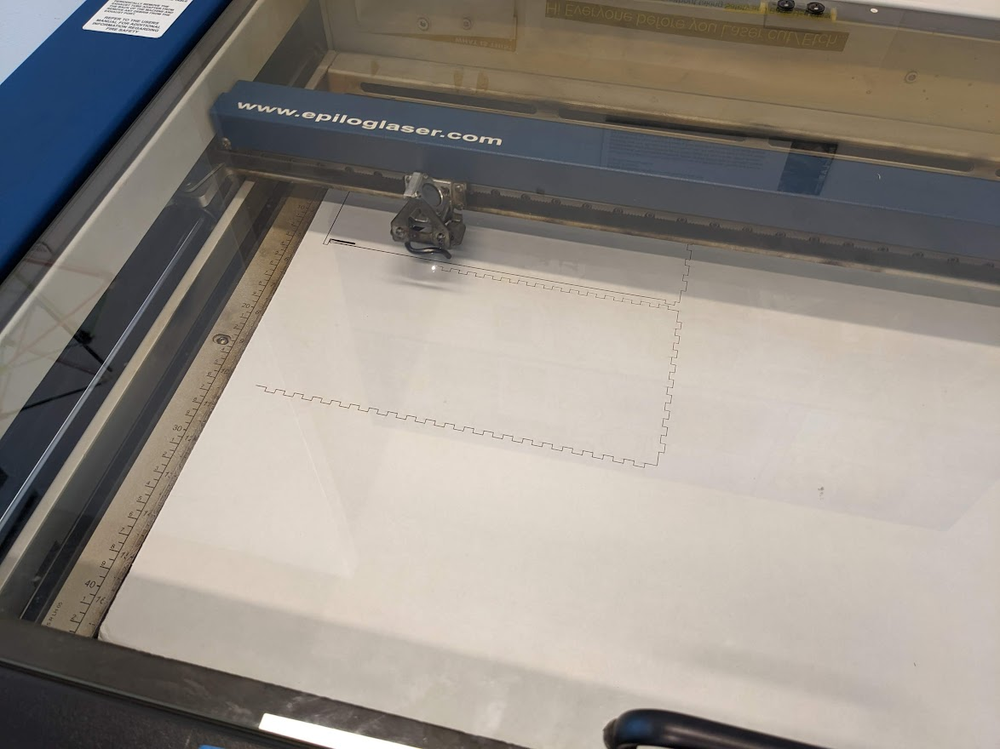
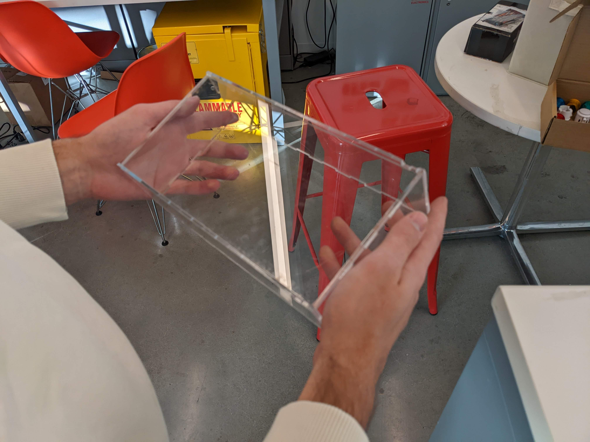
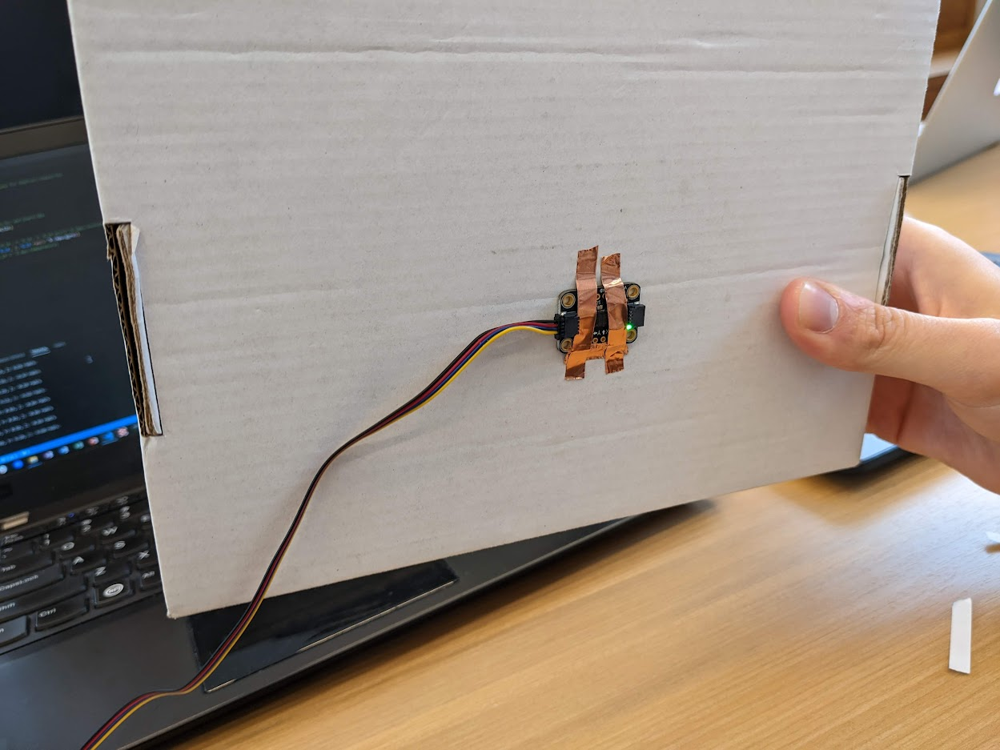
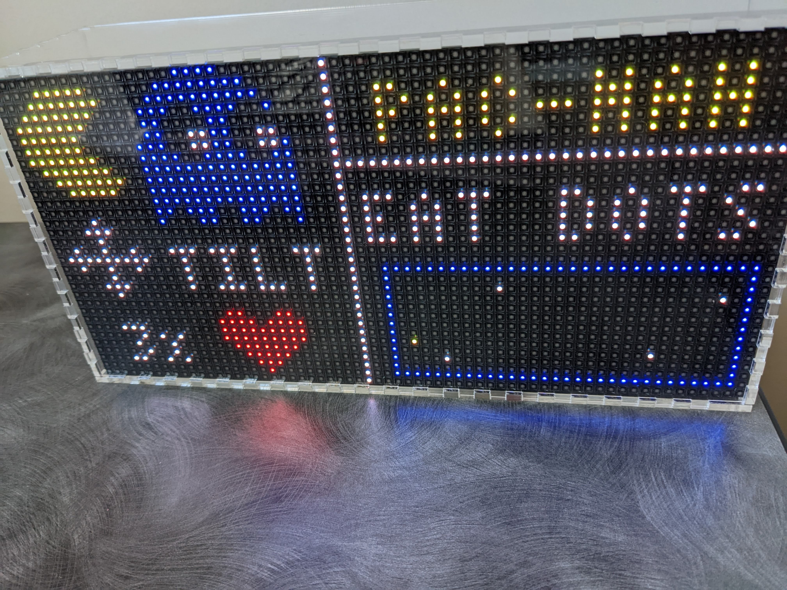
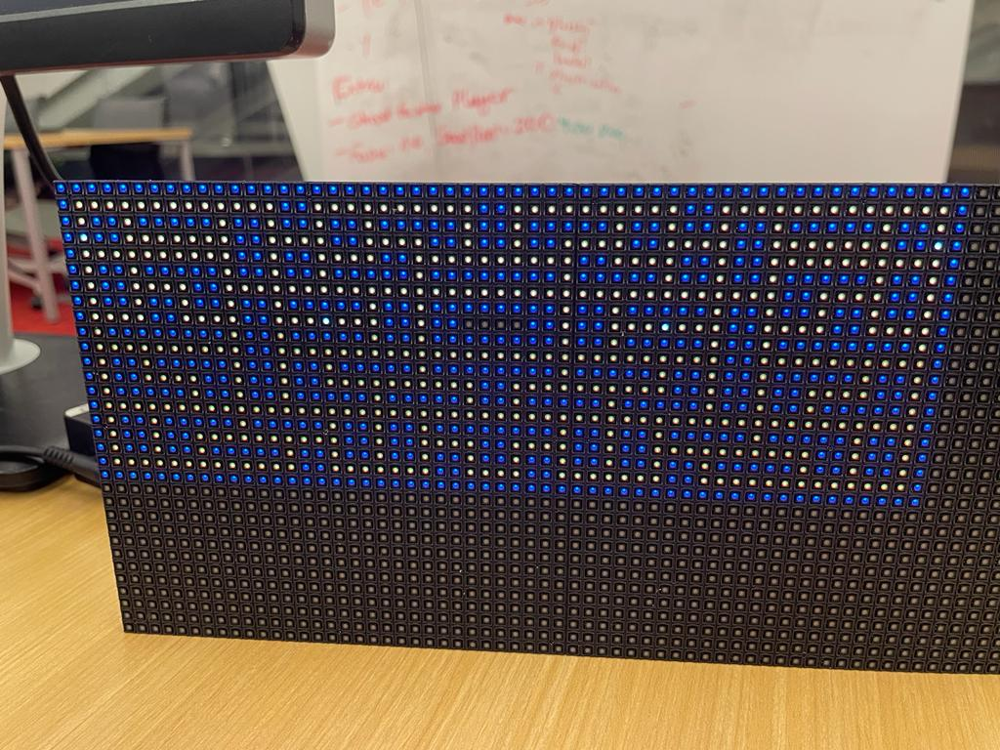

# Final Project: Matrix Gaming Console

Rahul Jain, Yusef Iskandar

---

<!-- TABLE OF CONTENTS -->
<details open>
  <summary>Table of Contents</summary>
  <ol>
    <li>
      <a href="#about-the-project">About The Project</a>
      <ul>
        <li><a href="#demo">Demo</a></li>
        <li><a href="#description">Description</a></li>
        <li><a href="#built-with">Built with</a></li>
        <ul>
          <li><a href="#hardware-development">Hardware Development</a></li>
          <ul>
            <li><a href="#sensor-integration">Sensor Integration</a></li>
            <li><a href="#acryllic-case-design">Acryllic Case Design</a></li>
          </ul>
          <li><a href="#software-development">Software Development</a></li>
          <ul>
            <li><a href="#gyroscope-calibration">Gyroscope Calibration</a></li>
            <li><a href="#homescreen">Homescreen</a></li>
            <li><a href="#maze">Maze</a></li>
            <li><a href="#microphone-integration">Microphone Integration</a></li>
            <li><a href="#game-logic">Game Logic</a></li>
            <li><a href="#speaker-integration">Speaker Integration</a></li>
          </ul>
          <li><a href="#hardware-parts">Hardware Parts</a></li>
        </ul>
      </ul>
    </li>
    <li>
      <a href="#getting-started">Getting Started</a>
      <ul>
        <li><a href="#prerequisites">Prerequisites</a></li>
        <li><a href="#installation">Installation</a></li>
      </ul>
    </li>
    <li><a href="#usage">Usage</a></li>
    <li><a href="#license">License</a></li>
    <li><a href="#contact">Contact</a></li>
    <li><a href="#acknowledgments">Acknowledgments</a></li>
    <li><a href="#sources">Sources</a></li>
  </ol>
</details>


<!-- ABOUT THE PROJECT -->
# About The Project

<!-- DEMO -->
## Demo

The first video demonstrates our matrix panel and the functionality of the Pacman game. The second video shows our product during Cornell Tech's Open Studio, where lots of people got the chance to try it. 

[](https://www.youtube.com/watch?v=FJsH19XHq3g)


[](https://www.youtube.com/watch?v=YBvebi-GN_Y)


<!-- DESCRIPTION -->
## Description

Our project is a handheld matrix gaming console in which we have developed the game of Pacman from scratch. By tilting the board, the user can control the position of Pacman and eat food or ghosts to accumulate points. There's a catch though! The louder the environment the user is playing in, the more difficult the game. So put your skills to the test and play a game of Pacman!


<!-- BUILT WITH -->
## Built With

In the following section, we are explaining our entire process of the software as well as the hardware development. In addition we give you a list of the needed hardware parts to replicate this project. 

<!-- HARDWARE DEVELOPMENT -->
### Hardware Development

<!-- SENSOR INTEGRATION -->
#### Sensor Integration

After the ordered parts arrived, we wired the matrix panel, its corresponding matrix bonnet and the raspberry pi together and ran simple examples to see if the matrix panel was capable of displaying moving shapes fast enough. 



Since we want to use an accelerometer/gyroscope to sense the tilt of the matrix panel, we had to solder four pins to the back of the matrix hood. It was very difficult to solder these four pins, which are right next to each other, accurately. However, we were fortunate to get help from the supermakers at MakerLab who had more soldering experience than we did.



We also used a USB microphone that was simply plugged into one of the raspberry pi's USB slots. The raspberry pi and all other sensors as well as the speaker were placed on the back of the acryllic case. The image below shows the entire back of the case including raspberry pi, matrix bonnet, matrix panel, microphone and accelerometer/gyroscope (the speaker is missing from this image). 



<!-- ACRYLLIC CASE DESIGN -->
#### Acryllic Case Design

As a next step we designed the accryllic case for the matrix panel. We generated our design by adjusting pre-defined parameters using [Festi](https://www.festi.info/boxes.py/). We used the Universal Box with parallel finger joint holes. The final box design can be seen in the following [file](./imgs/final_box_design.ai). After generating an appropriate design, we used cardboard instead of acryllic for our initial prototype. 



We found some issues with the design related to the number of finger joints per side, the dimensions of the holes, and the actual dimensions of the case to ensure minimal play. After adjusting the design to fix these issues, we again used the makerlab's laser cutter to cut the final acrylic case, which can be seen in the picture below.  




### Software Development

#### Gyroscope Calibration

At the beginning of our software development phase, we worked on the calibration of the gyroscope/accelerometer. The two important angles to use with our matrix panel are "pitch" and "roll". To calculate these angles, we used the equations found below, which are derived from [here](https://ozzmaker.com/compass2/). 


To test the functionality of the matrix panel, we taped a gyroscope to a box and ran a script using the equations described above. 



After we found that the gyroscope worked and responded surprisingly well, we wrote some simple scripts to move a point on the matrix board by rotating the gyroscope. Here's a behind-the-scenes video showing some tests of the gyroscope readings and the progression of the Pacman's movement on the board.

[](https://www.youtube.com/watch?v=jXzmlWeQkb0)

#### Homescreen

Since we started working on this project, we agreed that we wanted the final product to be very intuitive to use and present in Open Studio. Therefore, we decided to design a home screen that will be displayed when the potential user sees our matrix panel and wants to start the game. The homescreen consists of a game tutorial on the left side. There, it is explained that you need to tilt the Matrix panel in the vertical and horizontal directions. It is also explained that the user has 3 lives before the game is over. On the right side of the homescreen, the user sees a small calibration board where he can get used to Pacman's movement by tilting the board before starting the game. To start the game, the user must eat the four white dots that can be seen in the blue box at the bottom right of the home screen. You can see the final start screen in the image below. 




#### Maze

The next step was to create a maze based on the available pixel size of the matrix panel. The matrix panel is 64x32, but columns 63 and 64 were reserved for displaying the player's remaining lives and his score. This means that our maze should be 62x32 in size. Unfortunately, we didn't find a maze that was that size, and we didn't find a good maze generator on the Internet. Our first approach was to take a maze that was a different size, display it on the matrix board, and then see if we could scale it until it fit perfectly. An image of this board [1](pacman_board_1.txt) can be seen below. 



Unfortunately, this was not the best approach, so we had to manually design a maze with 62x32 walls and continuously remove the walls to create a path for Pacman. This approach resulted in [2](pacman_board_2.txt). For the two boards described earlier, we assumed that Pacman gets food at every point he can step on. [Another approach](pacman_board_3.txt) we took was to place food at every other pixel. We assumed that this would make the board easier to understand after viewing. However, we discarded this approach because it was too cluttered and made it even harder for the user to understand the game. 

Maze Files [1](pacman_board_1.txt), [2](pacman_board_2.txt), [3](pacman_board_3.txt), [4](pacman_board_4.txt), [5](pacman_board_5.txt).


#### Microphone Integration

The unique feature of our Pacman game is that the speed of the game changes depending on the volume of the environment. This means that it is easier for a silent player to avoid enemies. To detect the volume, we integrated a USB microphone into the raspberry pi. We started with the same code we used in class for the microphone. The problem was that Pacman moved very slowly, taking about 1-2 seconds to move to another pixel. To make the existing code faster, we significantly increased the "frames per buffer", set the "update interval" to zero, and removed irrelevant code related to frequencies and other things. These changes have significantly increased the speed at which Pacman moves and enabled smooth interaction.


#### Game Logic


In the game we tried to get as close as possible to the real Pacman game. Each player has 3 lives and can earn points by eating food, where you can get 10 points for food and 50 points for power pellets. After eating a power pellet, the game switches to ghost mode, where Pacman can eat ghosts. For each ghost eaten, you get 200 points. The game has four enemies that start at four different corners of the board. Although there are four enemies, you have to distinguish between the scatter and chase modes. In scatter mode, the enemies do not actively chase Pacman, but focus on a specific point on the matrix panel and move in loops around that point. In this game, we have set these positions as the four corners of the maze, which means that the four enemies will run in loops around each corner of the maze when in chase mode. To make it harder for the player, we also have a chase mode. As mentioned earlier, each enemy starts in scatter mode, but after a certain amount of time the first enemy switches to chase mode, then the second, until in the end all enemies are in chase mode. In chase mode, the enemy is actively chasing Pacman's position. Looking for a suitable algorithm, we found an article that uses Breath First Search (BFS), which would be the best solution for this situation. The best next solution would be to optimize by minimum distance (also Manhattan distance). However, we were not able to successfully run the BFS algorithm, the code can be seen in our main file, we suspect that calculating the best next step when using BFS takes too much time. Therefore we decided to use the minimum distance algorithm, which does its job amazingly well.

Helpful resources we used for the game logic:
[1](https://gameinternals.com/understanding-pac-man-ghost-behavior),
[2](https://github.com/TechnoVisual/Pygame-Zero),
[3](https://pygame-zero.readthedocs.io/en/stable/#),
[4](https://github.com/szczys/matrixman)


#### Speaker Integration 

As a last step of the whole final project we integrated a speaker into the system to play common Pacman sound effects. We downloaded and used the intro music, the eating food, the eating power pellet, the eating ghost and the death sound effect from [here](https://www.classicgaming.cc/classics/pac-man/sounds).
In general, we had a lot of problems with using the microphone and speaker on the raspberry pi at the same time, which made it impossible to use the speaker we used in class. Therefore, we used a bluetooth speaker from JBL. Although we used a bluetooth speaker, it was not easy to make it work with libraries like VLC, Pygame, etc. Finally, with the help of the BlueAlsa library and the instructions of [this](https://introt.github.io/docs/raspberrypi/bluealsa.html) link, we managed to do it. 

### Hardware Parts

* Matrix Power supply 5V 4A - $15
  * https://www.mouser.com/ProductDetail/485-1466 
* Matrix Panel - $40
  * https://www.mouser.com/ProductDetail/485-2278 
* Matrix Bonnet - $15
  * https://www.mouser.com/ProductDetail/485-3211 
* Female DC Power Adapter - $2
  * https://www.mouser.com/ProductDetail/485-368 
* Gyroscope: MPU 6050 6 DoF - $13
  * https://www.mouser.com/ProductDetail/485-3886
* USB Microphone - $8
  * https://www.amazon.com/SunFounder-Microphone-Raspberry-Recognition-Software/dp/B01KLRBHGM 
* Raspberry Pi 3B+ - Have in the class kit
* StemmaQT Cables - Have in the class kit
* Raspberry Pi Power supply - Have in the class kit
* JBL Go Speaker - Personal belonging

<!-- GETTING STARTED -->
# Getting Started

To get a local copy of the project, run the following simple steps.

## Prerequisites

Our project uses the rpi-rgb-led-matrix panel library which can be viewed using [this](https://github.com/hzeller/rpi-rgb-led-matrix) link. The folder of this library is inside our project folder. 

## Installation

The following steps show you how to run the project.

1. Clone the repo
   ```sh
   $ git clone https://github.com/jainr3/Interactive-Lab-Hub.git
   ```
2. Go into the correct directory
   ```sh
   $ cd "Final Project"
   ```
3. Install the project requirements
   ```sh
   $ pip install -r requirements.txt
   ```
4. Run the project by using following command
   ```sh
   $ sudo python3 pacman.py --led-cols=64 --led-gpio-mapping=adafruit-hat --led-slowdown-gpio=4 --led-brightness=30 --led-no-drop-privs
   ```


<!-- USAGE EXAMPLES -->
# Usage

In this section, we are going to show you a video where users tested our product. We also presented the matrix panel during Cornell Tech's Open Studio, where lots of people got the chance to try our product. 

### General User Testing

[](https://www.youtube.com/watch?v=5i83VmwyNsk)


<!-- LICENSE -->
# License

Distributed under the MIT License. See `LICENSE.txt` for more information.


<!-- CONTACT -->
# Contact

Rahul Jain - rj299@cornell.edu

Yusef Iskandar - yi78@cornell.edu

Project Link: [Final Project](https://github.com/jainr3/Interactive-Lab-Hub/edit/Fall2022/Final%20Project/)


<!-- ACKNOWLEDGMENTS -->
# Acknowledgments

We thank our professor Wendy Ju and the TA's Alexandra Bremer and Stacey Li for their amazing support throughout the entire project. 


<!-- SOURCES -->
# Sources

* https://introt.github.io/docs/raspberrypi/bluealsa.html
* https://gameinternals.com/understanding-pac-man-ghost-behavior
* https://github.com/TechnoVisual/Pygame-Zero
* https://pygame-zero.readthedocs.io/en/stable/#
* https://github.com/szczys/matrixman
* https://www.festi.info/boxes.py/
