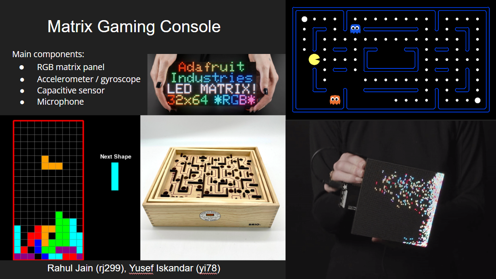
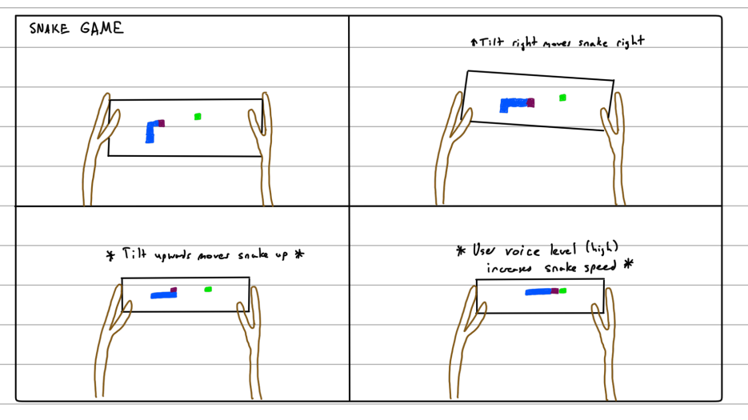
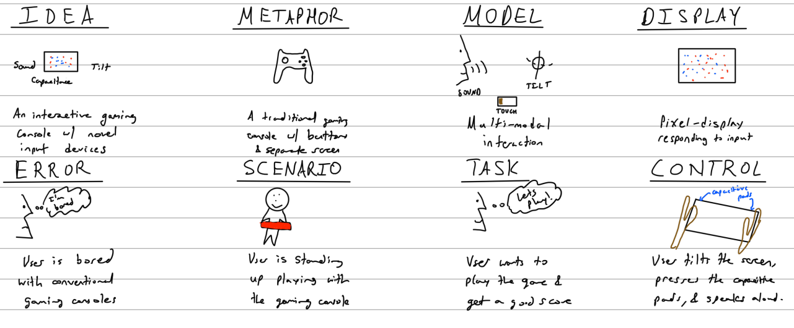
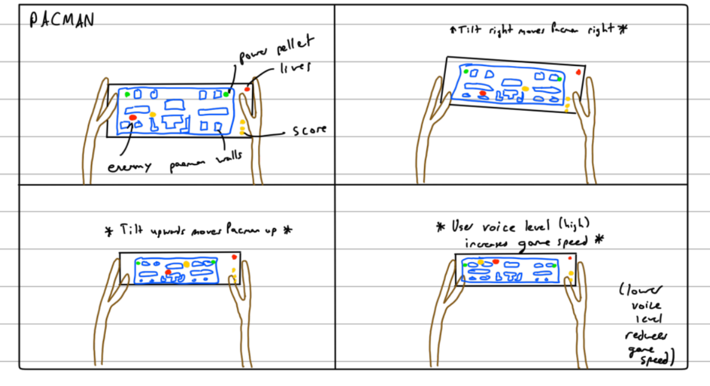

# Final Project: Matrix Gaming Console

Rahul Jain, Yusef Iskandar

## Project Plan

### Project Big Idea

The idea is to create an interactive RGB matrix panel on which the user can play games. The difference from conventional games is that the angular movement of the matrix panel is detected by a gyroscope and displayed in the game. Additionally, capacitive sensors and a microphone will be used to allow the user to control special aspects of the game with touch or their voice. 

Potential games ideas:
* Pacman:
  * Gyroscope: Side to side tilt to move the player left to right
  * Capacitive sensors: press for activating features like 2x speed
  * Microphone: if the user is close to dying, they can yell (and press and hold the capacitive sensor) and activate a random teleport feature which moves them around the board; but it also reduces their score
* Maze:
  * Gyroscope: Side to side tilt to move the marble left to right
  * Capacitive sensors: reset and start from initial point
  * Microphone: Loud sound unlocks a hidden passage (moves walls around), but it reduces their score
* Tetris:
  * Gyroscope: Side to side tilt to move the pieces left to right
  * Capacitive sensors: Rotate orientation of pieces
  * Microphone: Loud sound unlocks a hidden passage (moves walls around), but it reduces their score
* Others: Snake, Brick Breaker, Etch-a-sketch

### Project Timeline

* WEEK 12: Concept Design
  * Brainstorming ideas and developing the interaction
  * Storyboarding + Verplank Diagrams
* WEEK 13: Physical Hardware Development
  * Nov 15: Ordered parts arrive
  * Testing functionality of individual components (Matrix panel, Gyroscope, Capacitive sensor, Microphone)
    * Gyroscope calibration
  * Soldering + Wiring components + Power
    * Solder gyroscope connection onto the matrix bonnet
    * Connect gyroscope / capacitive sensor over I2C bus
  * Create a cardboard + acrylic casing
    * Take measurements / account for spacing of components (including Pi, sensors, power cables)
    * Create holes for power cables / heat vent
* WEEK 14: Software Development
  * Test gyroscope, capacitive sensor interaction
  * Design home screen for the games + games themselves
  * Test with users
* WEEK 15 / 16:
  * Cleaning up code; documenting process

### Parts Needed

* Matrix Power supply 5V 4A - $15
  * https://www.mouser.com/ProductDetail/485-1466 
* Matrix Panel - $40
  * https://www.mouser.com/ProductDetail/485-2278 
* Matrix Bonnet - $15
  * https://www.mouser.com/ProductDetail/485-3211 
* Female DC Power Adapter - $2
  * https://www.mouser.com/ProductDetail/485-368 
* Gyroscope: MPU 6050 6 DoF - $13
  * https://www.mouser.com/ProductDetail/485-3886
* USB Microphone - $8
  * https://www.amazon.com/SunFounder-Microphone-Raspberry-Recognition-Software/dp/B01KLRBHGM 
* Raspberry Pi 3B+ - Have in the class kit
* StemmaQT Cables - Have in the class kit
* Capacitive Touch Sensor - Have in the class kit
* Raspberry Pi Power supply - Have in the class kit

### Risks / contingencies

One of the biggest risks for our idea is that the parts ordered turn out to be defective. Specifically, if any one of the matrix panels, matrix bonnet, or power supply turns out to be faulty, we will need to reorder parts which can take time. Another risk is that something unexpected arises when we try to make connections between the components. In general, our project plan is somewhat ambitious for the time frame as there are a lot of unknowns with both the hardware and software.

### Fall-back plan

One fall-back plan to mitigate the risk that the parts are defective is that we use any display we have and connect it with a HDMI cable to the raspberry pi. Another idea could be to use the gyroscope in an old mobile phone or a separate handheld controller (separate RPi) and stream the data to the display. To mitigate the risk of the unknowns in our project, we will focus on the core implementation first, which includes developing the main interaction components, before moving on to more complex things like creating better graphics / complex game logic.

## Functional Checkoff 

The video for the functional checkoff is below. The video shows the matrix gaming console with Pacman implemented on it. The main interaction components that are shown include tilting the board to move pacman around as well as the volume level detection which impacts the speed of the game. Additionally, we have included some more sketches and photographs from the work we have done so far in the subsequent sections.

### Revised concept design for Pacman

The storyboard for Pacman is below. From the project plan we modified the idea to include the following components:
* Gyroscope: Side to side tilt to move the player left to right
* Microphone: Loud volume = faster game speed, Quieter volume = slower game speed; a faster game speed makes it harder to execute precise maneuvers around the walls
* Speaker (in progress): Special game states like pacman death, eating a ghost, game over have audio feedback to tell the user that they have occurred

Below are some images from connecting the physical components, wiring, soldering, and casing design.

## Physical Hardware Development

### Sensor Integration

After the ordered parts arrived, we wired the matrix panel, its corresponding matrix bonnet and the raspberry pi together and ran simple examples to see if the matrix panel is able to display moving shapes fast enough. 

Since we want to use an accelerometer/gyroscope to detect the tilt of the matrix panel, we had to solder four pins on the back of the matrix bonnet. It was very challenging to solder those four pins which are directly next to each other very accurately. However, we were fortunate enough to get help from Supermakers in the MakerLab which were more experienced in soldering than us.

We also used a USB microphone which was easily plugged into one of the raspberry pi's USB slots. The raspberry pi and all other sensors as well as the speaker were all put into the back of the acryllic case. The image below shows all the back of the case including raspberry pi, matrix bonnet, matrix panel, microphone and accelerometer/gyroscope (speaker missing in this image). 

### Acryllic case design

As a next step we designed the accryllic case for the matrix panel. We generated our design by adjusting pre-defined parameters on https://www.festi.info/boxes.py/. We used the Universal Box with parallel finger joint holes. The final box design can be seen in the following [file](./imgs/final_box_design.ai). After generating an appropriate design, we used cardboard instead of acryllic for our initial prototype. 

We found out some issues with the design that were related to the number of finger joints per face, with the dimensions of the holes, and with the actual dimensions of the box to ensure minimal play. After adjusting the design to address those issues, we used the laser cutter of the makerlab again to cut the final acryllic case that can be seen in the image below.  

## Software Development

Below are some images from inital testing of the matrix panel.

### Gyroscope Calibration

In the beginning of our software development phase we worked on the calibration of the gyroscope/accelerometer. The two important angles that are important for the usage of our matrix panel are "pitch" and "roll". For the calculation of those angles we used the equations that can be found below and are derived from https://ozzmaker.com/compass2/. 

To test the functionality of the matrix panel, we taped a gyroscope to a box and ran a script using the equations described above. 

After we found out that the gyroscope was working and has been suprisingly responsive, we proceeded and wrote some simple scripts to move a dot on the matrix panel by rotating the gyroscope. Here is a behind-the-scenes video for some testing of the gyroscope readings and the progression towards moving the Pacman around the board.

### Homescreen

Since we started working on this project we both agreed that we want to make the final product very intuitive to use as well as showcase it in Open Studio. Therefore, we decided to design a homescreen which can be seen when the potential user's see our matrix panel and want to go ahead and play. The homescreen consists of game instructions on the left hand side. It tells you that you have to the tilt the matrix panel in the vertical and horizontal direction. It also explains that the user has 3 lives before the game is over. On the right hand side of the homescreen, the user can see a small calibration board where the user can get used to moving pacman by tilting the board before actually starting the game. To start the game, the user has to eat the four white dots that can be seen in the blue box at the left bottom of the home screen. You can see our final home screen in the image below. 

### Maze

As a next step we had to create a maze based on the available pixel size of the matrix panel. The matrix panel is 64x32, however column 63 and 64 were reserved for displaying the player's remaining lives as well as their score. This means our maze should be size 62x32. Unfortunately, we didn't find any maze that has this specific size and we also didn't find any good maze generator on the web. Our first approach was taking a maze that has a different size and display it on the matrix panel and see afterwards if we can scale it until it fits perfectly. An image of this board [1](pacman_board_1.txt) can be seen below. 

Unfortunately, this was not the best approach which is the reason why we had to manually design a maze starting with 62x32 walls and continuously remove the walls to make a pathway for pacman. This approach resulted in [2](pacman_board_2.txt). For the two boards described previously, we assumed that Pacman is able to get food at every dot he can step on. Another approach we pursued was placing food at every other dot. Our assumption was this would make the board easier to understand after looking at it. However, we ended up rejecting this approach since it became too crowded and made it even harder to understand for the user. 

Maze Files [1](pacman_board_1.txt), [2](pacman_board_2.txt), [3](pacman_board_3.txt).

### Microphone Integration

The unique feature of our Pacman game is that based on the volume of the environment the speed of the game changes. This means that for a silent player it will be easier to avoid enemies. To detect the volume we are integrating a USB microphone into the raspberry pi. We started by using the same code we used in class for the microphone. The issue was that Pacman was moving very slowly, it took him approximately 1-2 seconds to move to another pixel. To make the existing code faster we significantly increased the "frames per buffer", changed the "Update Interval" to zero, and removed irrelevant code related to frequencies and other things. Those changes increased the speed of Pacman moving significantly and made a smooth interaction possible.

### Game Logic

For the game we tried to be as close to the real Pacman game as possible. Every player has 3 lives and can accumulate points by eating food whereas you can get 10 points for food and 50 points for power pellets. After eating a power pellet the game turns into the ghost mode which enables Pacman to eat ghosts. For each ghost eaten you can get 200 points. The game has four enemies which start at four different corners of the game. Although there are four enemies we have to distinguish between scatter and chase mode. When the enemies are in scatter mode they are not actively chasing Pacman but are focusing on a specific dot on the matrix panel and will move in loops around this point. In this game we have set those positions as the four corners of the maze which means that the four enemies will go in loops around each corner of the maze when they are in scatter mode. To make the gamer harder we also have a chase mode. As previously mentioned every enemy starts in scatter mode but after a pre-defined time the first enemy turns into chase mode, then the second until in the end all enemies are in chase mode. In chase mode the enemy actively chases the position of Pacman. To find an appropriate algorithm we found an article that uses Breath First Search (BFS) which would be the best solution for this situation. The best next solution would be optimizing by minimal distance (also Manhattan distance). However, we were not able to run the BFS algorithm successfully, the code can be seen in our main file, we assume that it takes too much time to compute the best next step when using BFS. This is why we wended up using the minimum distance algorithm which does its work suprisingly really good.

Helpful resources we used for the game logic:
https://gameinternals.com/understanding-pac-man-ghost-behavior
https://github.com/TechnoVisual/Pygame-Zero
https://pygame-zero.readthedocs.io/en/stable/#
https://github.com/szczys/matrixman

### Speaker Integration 

As a last step of the whole final project we integrated a speaker into the system to play common Pacman sound effects. We downloaded and used the intro music, the eating food, the eating power pellet, the eating ghost and the death sound effect from https://www.classicgaming.cc/classics/pac-man/sounds.
In general, we had lots of issues using the microphone and the speaker simultaneously on the raspberry pi which made it not feasible to use the speaker we were using in class. Therefore we are using a bluetooth speaker from JBL. Even though we were using a bluetooth speaker it was not easy to make it work with libraries like VLC, Pygame etc. Finally we were successful using the library BlueAlsa and the instructions in the following link (https://introt.github.io/docs/raspberrypi/bluealsa.html). 

### User tests

VIDEOS!!!

### List of software errors

* Pacman walking through the ghost
* When you play the game and lose then game restarts and shows both homescreen and the game board
* Ghost can't use the tunnel
* When ghosts turned into enemies, the one that Pacman ate spawned outside the map
* Gyroscope produces MathDomainError when pitch is equal to 90 or -90 degrees
* Ghost doesn't go to jail after its eaten
* Issues with BFS algorithm
* Pacman eats ghost near wall, Pacman pixel is colored in a wall and ghost does not go in jail
* After loosing one life, when eating power pellet nothing happens, no ghost mode

## Code Structure

The main code for the project is located in [pacman.py](pacman.py) which has dependencies in [pacman_sensors.py](pacman_sensors.py), [sample_base.py](samplebase.py) and a few other library files.

The initial testing files and other debugging files that we used are: [gyroscope_test.py](gyroscope_test.py), [led_panel_test.py](led_panel_test.py), [runtext.py](runtext.py), and [integration_test.py](integration_test.py).
